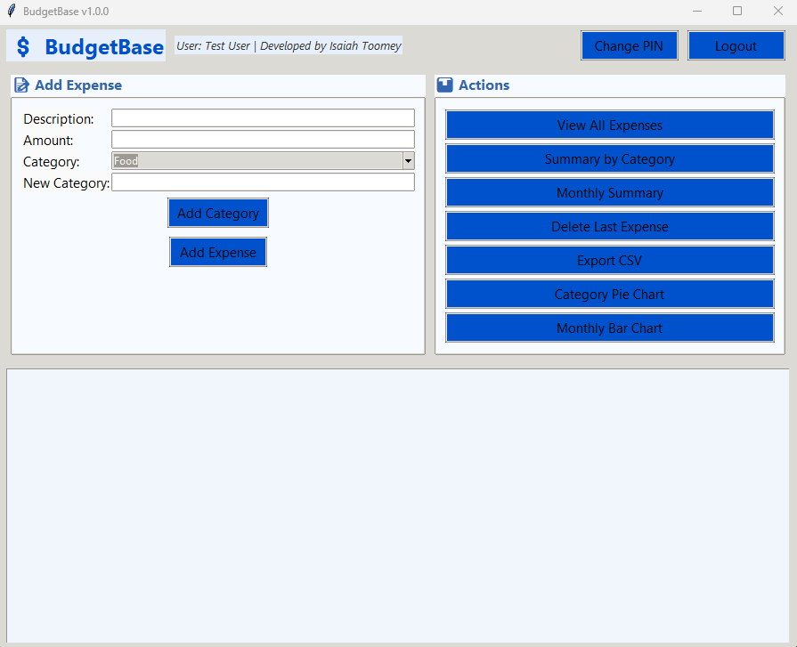
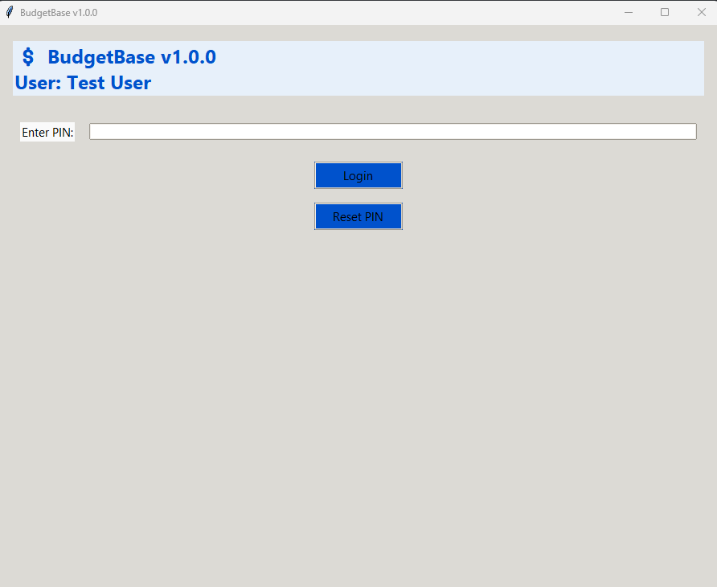
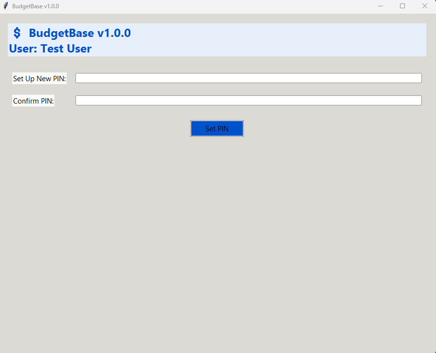
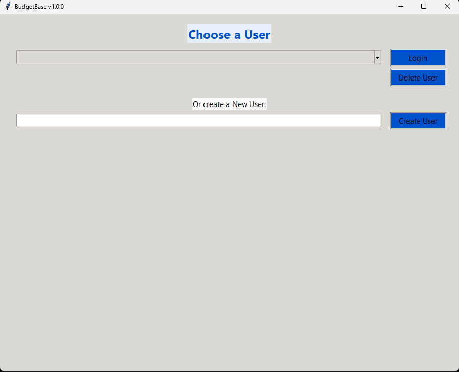
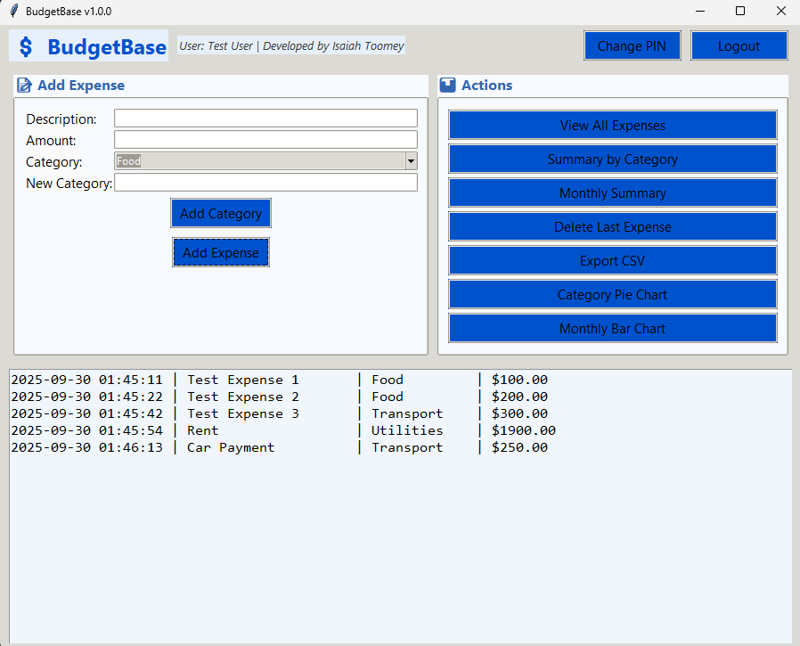
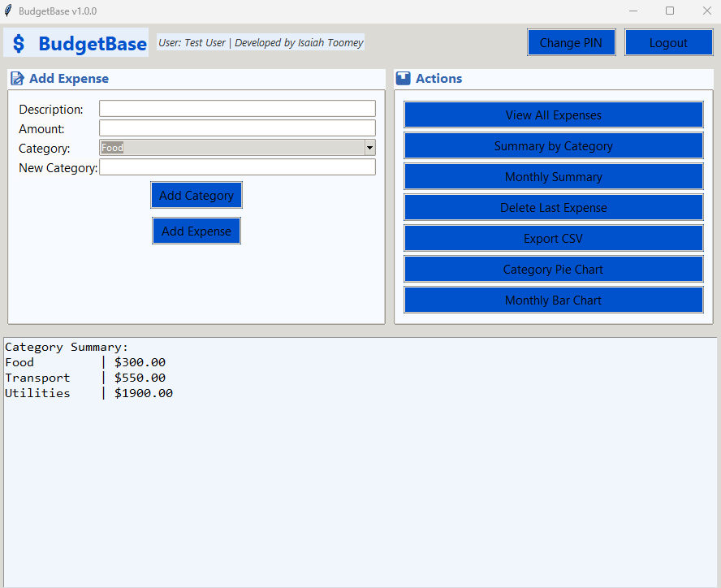

# Personal Expense Tracker

Track your expenses with ease using a simple, interactive Python-based app.

---

## Overview

The **Personal Expense Tracker** helps users manage and visualize their personal finances effortlessly. Built with Python, Tkinter, Pillow, and Matplotlib, the app allows you to:

- Add, edit, and delete expenses
- Categorize spending for better insights
- Visualize spending trends with interactive charts
- Run as a standalone Windows `.exe` without needing Python installed

---

## Features

1. **Expense Management**  
   Add new expenses with details like amount, category, and date. Edit or remove existing entries as needed.

2. **Categorization**  
   Organize your spending into categories for better tracking and budgeting.

3. **Data Visualization**  
   See your spending trends over time with interactive charts.

4. **Standalone Executable**  
   No Python installation required — run the app directly as a `.exe`.

---

## Installation

### Windows (.exe)
1. Download the latest release from the [Releases](https://github.com/toomeyisaiah/Personal-Expense-Tracker/releases) page.
2. Run the `.exe` file.
3. The app will launch immediately with a user-friendly interface.

### Source Code
1. Clone this repository:
   ```bash
   git clone https://github.com/toomeyisaiah/personal-expense-tracker.git
2. Navigate to the project directory:
    ```bash
    cd personal-expense-tracker
3. Run the command-line version:
    ```bash
    python app.py

    
## Usage

- Launch the app and use the GUI to add your expenses.  
- Select categories to categorize spending.  
- View charts to analyze your monthly or weekly spending trends.  

## Screenshots

  
*Example of the main interface.*

  
*Example of the Main User Login / Creation Screen.*

  
*Example of the User Pin Creation Tool.*

  
*Example of the User Selection Screen.*

  
*Example of the output when the All Expenses button is pushed.*

  
*Example of the output when the Category Summery button is pushed.*

  
*Example of the output when the Monthly Summery button is pushed.*

## Contributing

Contributions are welcome! Please open an issue or submit a pull request for improvements or bug fixes.


# Author

Isaiah Toomey
Founder of Toomey Software
